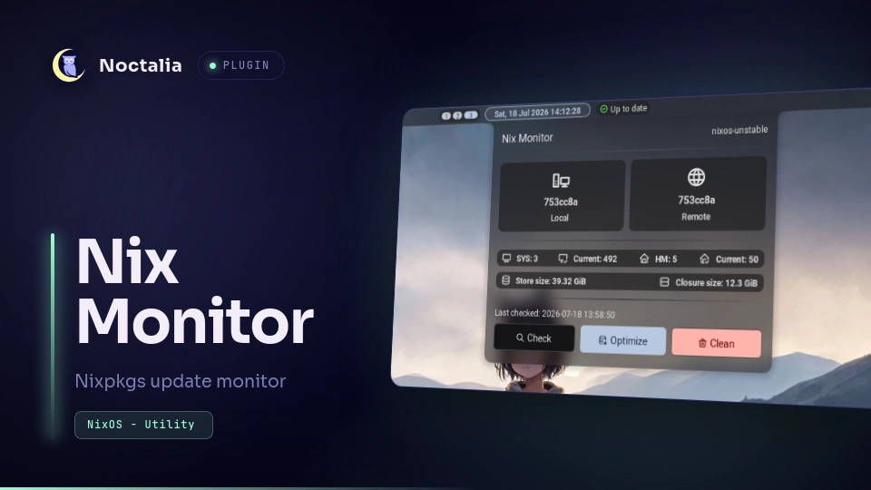

# Nix Monitor

**Nix Monitor** checks Nixpkgs update by comparing local nix hash and remote Nixpkgs's hash

## Features
 - Shows local and remote nixpkgs hash
 - Shows NixOS and optionally Home Manager generations
 - Shows Nix Store size and closure size
 - Customizable clean and update command

 ## Requirements
  - Git
  - NixOS commands (`nix`, `nixos-rebuild`, `nixos-version`)
  - Linux tools (`du`, `cat`, `awk`, `grep`, `tail`, `wc`, `pkill`)
  - Optionally `home-manager`
